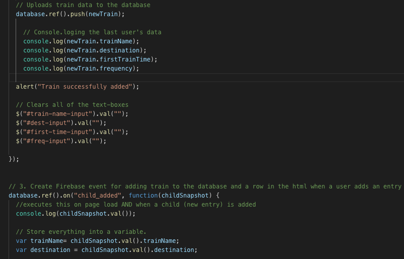

# Train-Scheduler-

## Created by Christie Byrne
### UC Berkeley Extension Coding Bootcamp

Homework for Section 7 Firebase

## Purpose of the game
This is a train schedule application that incorporates Firebase to host arrival and departure data. 

This will retrieve and manipulate the information entered with Moment.js. 

At the bottom, this website will provide up-to-date information about various trains, namely their arrival times and how many minutes remain until they arrive at their station.

<a src= "https://byrnec.github.io/Train-Scheduler-/" target = " "> Try it out here!</a>

## Built With:
HTML

CSS

JavaScript

jQuery Library

JSON

Bootstrap CSS Library

Firebase